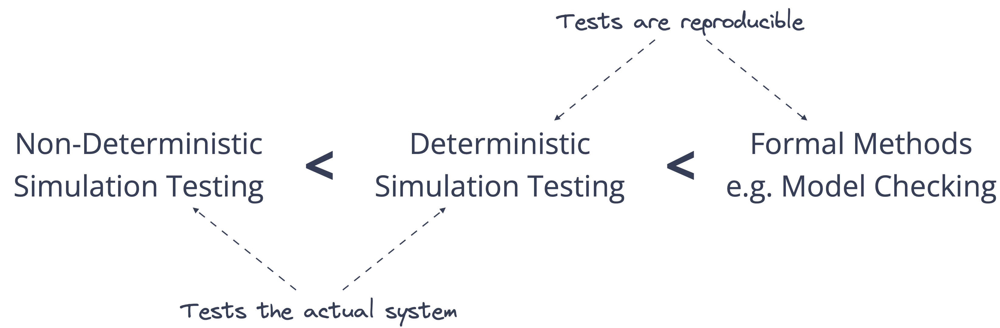
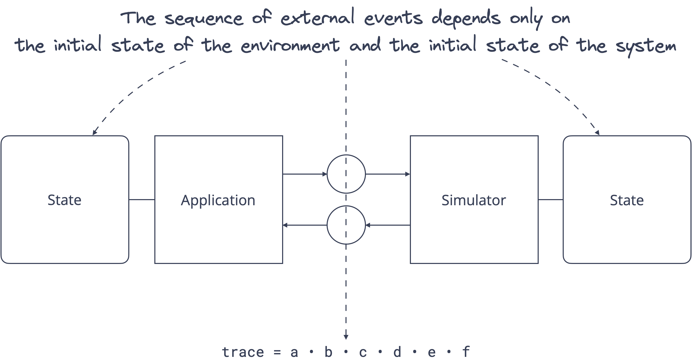

At Resonate, we consider deterministic simulation testing (DST) to be a cornerstone of our mission to build correct and reliable distributed systems. While an increasing array of projects, including [Foundation DB](https://www.foundationdb.org), [TigerBeetle DB](https://tigerbeetle.com), and [Resonate](https://www.resonatehq.io) itself, have embraced DST, along with companies like [Antithesis](https://antithesis.com) providing platforms dedicated to this approach, comprehensive information remains limited.

In this post, we’ll demystify DST by constructing an accurate yet concise mental model. We will explore the theoretical foundations as well as practical applications—and why I believe DST will soon become indispensable for developing distributed systems.

<!-- truncate -->

## The Challenge

The task of testing concurrent and distributed systems presents formidable challenges: concurrency introduces non-determinism manifested through unpredictable execution order while distribution introduces non-determinism manifested through unpredictable partial failures, creating a vast behavior space to consider.

Notably, execution traces resulting from rare event combinations are particularly elusive. These are not only challenging to observe, but also even more challenging to reproduce, giving rise to the infamous Heisenbugs.

:::note A System's Multiverse

Concurrency results in non-determinism in the form of random execution order: The concurrent composition of a set of processes refers to the set of all possible interleavings, so given two processes `P = ⟨a, b⟩` and `Q = ⟨c, d⟩`, the set of all possible interleavings is:

```
P | Q = { ⟨a, b, c, d⟩, ⟨a, c, b, d⟩, ... ⟨c, d, a, b⟩ }
```

Distribution results in non-determinism in the form of random partial failures: adverse events like crashes or network partitions further complicate interleavings:

```
P | Q | 💀
```

We can argue that due to the non-determinism introduced by concurrency and distribution we are not dealing with one but many systems－one per possible interleaving

:::

Traditional testing methodologies, including unit, integration, and end-to-end tests, often prove inadequate for holistically capturing the safety and liveness properties of a concurrent, distributed system. Due to the inherent non-deterministic nature of systems, tests are not reproducible.

This gap in the testing landscape is bridged by deterministic simulation testing, positioning itself between non-determinsitic simulation testing (e.g. jepsen or chaos engineering) and formal methods (e.g. TLA+, p-lang).



### Non-Determinisitic Simulation Testing

Non-determinisitic simulation testing identifies correctness violations by validating the system itself. Tools such as Jepsen follow a probabilistic, non-reproducible exploration of possible execution traces to find correctness violations by elevating the propability of rare execution traces self-induced by frequent process crashes and network partitions. Their primary limitation is reproducibility; despite increased chances of bug detection, their sporadic nature hampers consistent reproduction for subsequent analysis.

### Formal Methods

Formal methods identify correctness violations by validating a formal model of a system. Tools such as TLA+ follow a determinisitc, reproducible exploration of possible execution traces to find correctness violations. Their primary limitation is the model-system discrepancy; a correct conceptualization (mode) does not imply a correct implementation (system).

## Deterministic Systems

Understanding deterministic simulation testing hinges on understanding deterministic execution. Let's demystify deterministic execution by constructing a minimal system model illustrated through a practical GoLang example.

### System Model

A system's execution unfolds in a series of discrete steps, that is, discrete events (called a trace) governed by the rules of its runtime environment. Each event is categorized as either observable (external) or non-observable (internal) based on its relevance to us.

**A system is deterministic if there exists only one possible trace of external events.**

In essence a determinisitc system is a system without choice.

:::note Formal Model

An external trace or trace is a projection of a complete trace containing only external events where the deliniation of internal and external events is user supplied.

```
trace = ⟨e₁, e₂, e₃, eₙ⟩, with eᵢ ∈ External
```

The function traces maps a System S and the Initial State σ under the evaluation rules of a Runtime R to the set of all possible external traces.

```
traces(S, σ, R) = {trace₁, ... traceₙ}
```

A system is determinitic if for every Initial State σ, the cardinality of the set of traces for System S under Runtime R is 1:

```
∀ σ ∈ Σ : | traces(S, σ, R) | = 1
```

A system is non-deterministic if there exists an Initial State σ such that the cardinality of the set of traces for System S under Runtime R is larger than 1:

```
∃ σ ∈ Σ : | traces(S, σ, R) | > 1
```

:::

### Example

With the theoretical foundations in place, let's explore a practical application. Consider the following GoLang example, which sums up the values in a key-value map. For this illustration, we'll define the trace of the execution as the lines printed to standard output, where the events are labeled as `i:number`, `v:number`, and `s:number`.

GoLang does not specify an iteration order for key-value maps, in fact, golang explicitly randomizes the iteration order so software engineers don't implicitly rely on an unspecified order. Two different executions of the program may produce different traces.

```go
package main

import "fmt"

func main() {
    // Create a map with string keys and integer values
    myMap := map[string]int{"key.1": 2, "key.2": 3, "key.3": 5}

    // Initialize a variable to hold the cumulative sum of the values
    sum := 0

    // Print the initial value
    fmt.Println("i:", sum)

    // Loop over all key-value pairs in the map
    for _, value := range myMap {
        // Print the current value
        fmt.Println("v:", value)
        // Add the value to the sum
        sum += value
    }

    // Print the final total sum of the values
    fmt.Println("s:", sum)
}

```

Is this program deterministic? The answer hinges on our classification of events. If we consider `i:number` and `s:number` as external events but `v:number` as an internal event, the program is deterministic as the set of all possible traces has only one element:

```
i:0 -> s:10
```

If we consider `i:number`, `s:number`, and `v:number` as external events, the program is non-determinitic as the set of all possible traces has six elements:

```
i:0 -> v:2 -> v:3 -> v:5 -> s:10
i:0 -> v:2 -> v:5 -> v:3 -> s:10
i:0 -> v:3 -> v:2 -> v:5 -> s:10
i:0 -> v:3 -> v:5 -> v:2 -> s:10
i:0 -> v:5 -> v:2 -> v:3 -> s:10
i:0 -> v:5 -> v:3 -> v:2 -> s:10
```

This example highlights how the same program's determinism or non-determinism hinges on our perspective—specifically, on our definitions of internal versus external events.

## Deterministic Simulation Testing

We delineate a system into two main components: application and environment. The application and the environment interact via a well defined protocol (API).


The delineate of application and environment－while ultimately determined by the system designer－follows the philosophie of deliniating of the orchestration of commands (application) and the execution of commands (environment).

The core idea is to substitute the environment with a simulator: Deterministic simulation testing repeatedly executes an application in a simulated environment under changing initial conditions, monitoring that the correctness constraints are maintained across executions.



**The composition of application and simulator must yield a deterministic system, that is, given the same initial state, the system will always yield the same trace of external events.**

Now the progression of the system is determined by the intial state of the system. In practice the minimal initial state is the seed for a pseudo random number generator that the simulator uses to drive the system forward.

**With this you can reproduce an entire execution by restarting the system with the same random seed.**

## It's about time

Many complex systems depend on real time in some way. For example, a stream processing system may offload a batch from hot storage to cold storage two weeks after creation of the batch. Time dependent code path are hard to test—and even harder to test repeatedly.

A side effect not of deterministic simulation testing but of virtualizing the environment is virtualizing time: The simulator does not only simulate the execution of commands but can also simulate the progression of time. This allows us to simulate months or years of continuous operations in mere hours of testing.

## Limitations

Deterministic simulation testing is a capable but intrusive technique: The composition of application and simulator must yield a deterministic system－a high bar to meet. For example, if you target golang you have no contol over goroutine scheduling, forcing you to "work around" golangs concurrency abstractions [by building your own](https://github.com/resonatehq/resonate/tree/main/internal/kernel/scheduler).

## Conclusion

Deterministic simulation testing is invaluable to our mission to build correct and reliable distributed systems. In the next blog post I will detail Resonate's implementation of deterministic simulation testing in golang. In the meantime, head over to our [repository](https://github.com/resonatehq/resonate) and check out our implementation yourself.
