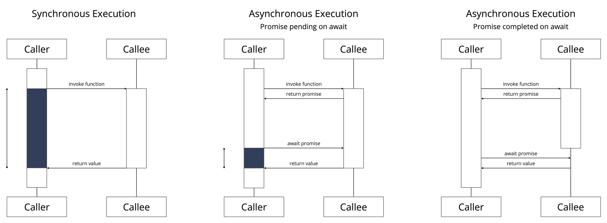
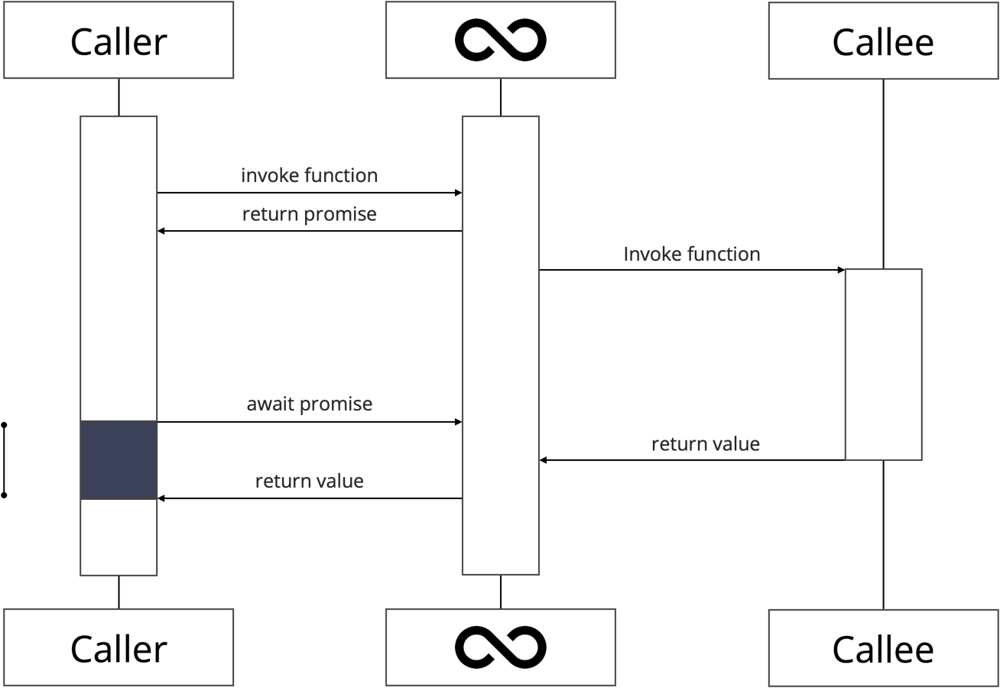
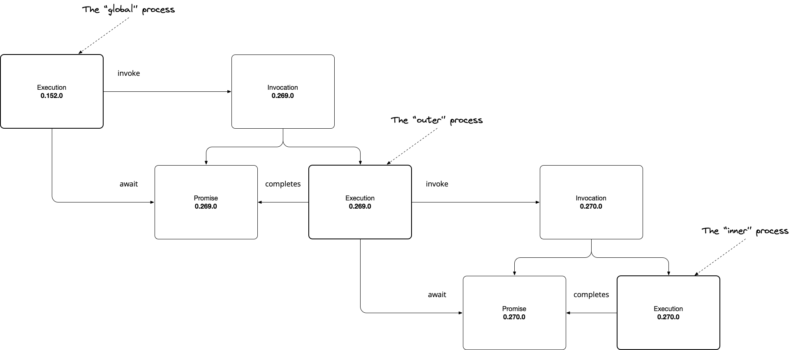
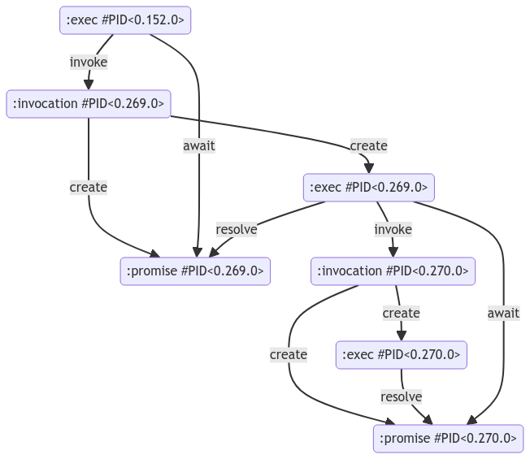
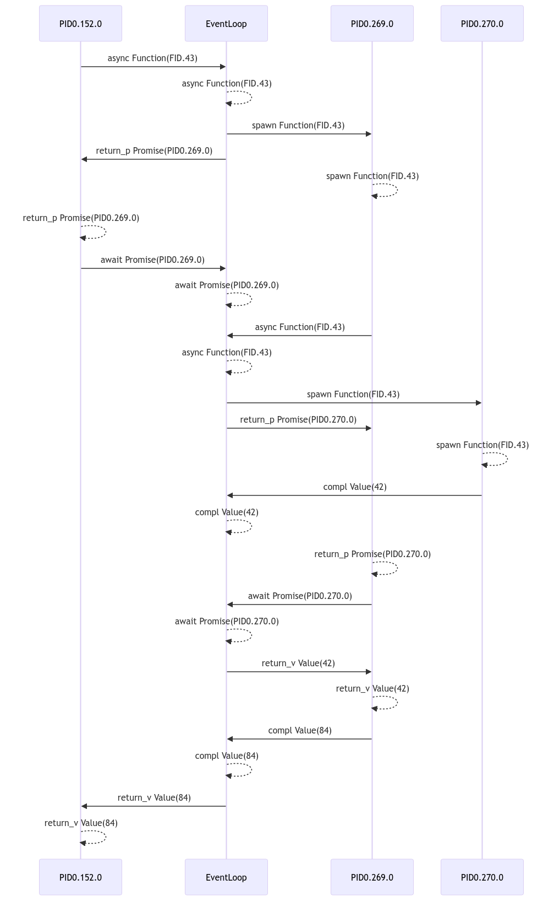

Resonate is pioneering a novel programming model to distributed computing called Distributed Async Await. Distributed Async Await is an extension of traditional async await that goes beyond the boundaries of a single process and makes distributed computing a first-class citizen.

Given that Distributed Async Await is an extension of async await, I figured a blog post exploring the mechanics of functions, promises, and the event loop would be fun.

<!-- truncate -->

:::info

This post explores the mechanics of async await using Elixir. Elixir's concurrency model offers an excellent platform for implementing the mechanics of async await. However, the approach outlined here is not intended as a guideline for Elixir application development.

:::

[The Code on GitHub](https://github.com/dtornow/async-await-mechanics)

## Introduction

Many of us were first introduced to async await when we learned JavaScript. Because JavaScript offers one of the most popular implementations, this introduction often shapes our understanding of async await, leading us to conflate the fundamental principles of the asynchronous programming model with the specific implementation decisions made by JavaScript.

The most common misconceptions are that async await necessitates a non-blocking, single-threaded runtime. JavaScript's runtime is non-blocking primarily _because_ it is single-threaded. However, asynchronous programming models can be implemented as both single-threaded and multi-threaded runtimes, and they can be implemented as non-blocking or blocking.

## From Sync to Async

The journey from synchronous to asynchronous programming is a shift from sequential to concurrent execution － essentially, instead of doing one thing at a time, we do multiple things simultaneously.



We will reason about synchronous and asynchronous programming in terms of pairs of events captured during the execution. We assume that traces contain the following events of interest:

- in synchronous programming
  - `invoke function` and `return value`.
- in asynchronous programming
  - `invoke function` and `return promise`,
  - `await promise` and `return value`.

### Synchronous Execution

A synchronous execution consists of a single round trip, one invoke-and-return-value interaction between the caller and callee. The caller suspends its execution until the callee completes its execution and returns a value (Figure 1., left).

### Asynchronous Execution & Promises

An asynchronous execution consists of two round trips, one invoke-and-return-promise interaction and one await-and-return-value interaction between the caller and the callee.

A promise can either be interpreted as a representation of the callee or as a representation of a future value. A promise is either pending, indicating that the callee is in progress and has not returned a value, or completed, indicating that the callee terminated and has retuned a value.

If the promise is pending on await, the callers suspends its execution until the callee completes its execution and returns a value (Figure 1., center). If the promise is completed on await, the caller continues with the returned value (Figure 1., right).

## The Event Loop



The runtime of async await is referred to as an Event Loop. An Event Loop is a scheduler that allows an asynchronous execution to register interest in a specific event. (In this blog we are only interested in the completion of a promise). Once registered, the execution suspends itself. When a promise completes, the Event Loop resumes the execution.

For the remainder of this blog, we will implement async await facilities and an Event Loop in Elixir. Why Elixir? For starters, mapping async await to Elixir is straightforward, making the implementation an excellent illustration. More importantly, mapping async await to Elixir allows us to dispel the common myth that async await is intrinsically non-blocking: by mapping asynchronous executions onto Elixir processes and deliberately blocking the process when awaiting a promise.

## Elixir Crash Course

Elixir is a dynamically typed, functional programming language that runs on the Erlang virtual machine (BEAM).

Elixir's core abstraction is the process, an independent unit of execution with a unique identifier. `self()` yields the identifier of the current process. All code executes in the context of a process. Elixir processes execute concurrently, with each process executing its instructions sequentially.

```Elixir
# Create a new process - You can use the Process Identifier to send messages to the process
pid = spawn(fn ->
  # This block of code will execute in a separate process
end)
```

Processes communicate and coordinate by exchanging messages. Sending a message is a non-blocking operation, allowing the process to continue execution.

```elixir
# Send a message to the process with identifier pid (non-blocking operation)
send(pid, {:Hello, "World"})
```

Conversely, receiving a message is a blocking operation, the process will suspend its execution until a matching message arrives.

```elixir
# Receive a message (blocking operation)
receive do
  {:Hello, name} ->
    IO.puts("Hello, #{name}!")
end
```

Arguably the most popular abstraction is a GenServer. A GenServer is a process like any other Elixir process. A GenServer abstracts the boilerplate code needed to build a stateful server.

```elixir
defmodule Counter do
  use GenServer

  # Client API

  # Starts the GenServer
  def start_link() do
    GenServer.start_link(__MODULE__, 0, name: __MODULE__)
  end

  # Synchronous call to get the current counter value
  def value do
    GenServer.call(__MODULE__, :value)
  end

  # Asynchronous call to increment the counter
  def increment do
    GenServer.cast(__MODULE__, :increment)
  end

  # Server Callbacks

  # Initializes the GenServer with the initial value
  def init(value) do
    {:ok, value}
  end

  # Handles synchronous calls
  def handle_call(:value, _from, state) do
    {:reply, state, state}
  end

  # Handles asynchronous messages
  def handle_cast(:increment, state) do
    {:noreply, state + 1}
  end
end

```

## Async Await in Elixir

The Async Await Module allows the developer to _express_ the concurernt structure of a computation while the Event Loop Module _implements_ the concurrent structure of a computation.

We will map an asynchronous execution of a function on an Elixir process executing the function. We will use the identifier, the pid, of the process to refer to the execution and the promise representing the execution.



Our goal is to run something like this:

```elixir

# outer refers to the pid of the outer Elixir process
outer = Async.invoke(fn ->

  # inner refers to the pid of the inner Elixir Process
  inner = Async.invoke(fn ->

    42

  end)

  # We use the pid to await the inner promise
  v = Async.await(inner)

  2 * v

end)

# We use the pid to await the outer promise
IO.puts(Async.await(outer))

```

## The Library

Let's start with the simple component, the library. Remember there are only two interactions, invoke a function and return a promise and await a promise and return a value. Invoke does not suspend the caller but await may suspend the caller if the promise is not yet resolved.

```elixir
defmodule Async do
  def invoke(func, args \\ []) do
    # invoke function, return promise
    # will never block the caller
    GenServer.call(EventLoop, {:invoke, func, args})
  end

  def await(p) do
    # await promise, return value
    # may block the caller
    GenServer.call(EventLoop, {:await, p})
  end
end
```

In Elixir terms:

- `GenServer.call(EventLoop, {:invoke, func, args})` is a blocking call, however, as we will see below, the method always returns immediately, therefore, this call never suspends the caller.
- `GenServer.call(EventLoop, {:await, p})` is a blocking call and, as we will see below, the function may not always return immediately, therefore, this call may suspend the caller.

## The Event Loop

On to the more complex component, the Event Loop.

### The State

The Event Loop tracks two entities: promises and awaiters.

```elixir
%State{
  promises: %{#PID<0.269.0> => :pending, #PID<0.270.0> => {:completed, 42}},
  awaiters: %{
    #PID<0.269.0> => [
      # This data structure allows us to defer the response to a request
      # see GenServer.reply
      {#PID<0.152.0>,
       [:alias | #Reference<0.0.19459.4203495588.2524250117.118052>]}
    ],
    #PID<0.270.0> => []
  }
}
```

#### Promises

`promises` associate a promise identifier with the status of the asynchronous execution the promise represents. The state of a promise is either

- `:pending`, indicating the execution is still in progress, or
- `{:completed, result}`, indicating the execution terminated with `result`.

#### Awaiters

`awaiters` associate a promise identifier with the list of execution identifiers that are waiting for the promise to be resolved: Each pid in the list corresponds to a process that executed an await operation on the promise and is currently suspended, waiting for the promise to be fulfilled. When the promise is resolved, these awaiting processes are notified and can continue their execution with the result of the promise.

### The Behavior

By tracking the current status of each async execution via promises and the dependencies between executions via awaiters, the Event Loop can orchestrate the concurrent execution of code. Three methods are all we need:

```elixir

defmodule EventLoop do
  use GenServer

  alias State

  def start_link(_opts \\ []) do
    GenServer.start_link(__MODULE__, State.new(), name: __MODULE__)
  end

  def init(state) do
    {:ok, state}
  end

  def handle_call({:invoke, func, args}, {caller, _} = _from, state) do
    # ...
  end

  def handle_call({:await, promise}, {caller, _} = from, state) do
    # ...
  end

  def handle_call({:return, callee, result}, {caller, _} = _from, state) do
    # ...
  end

end

```

#### Invoke

The invoke method spawns a new Elixir process and uses the process identifier, assigned to `callee`, as the promise identifier. The process executes the function via `apply(func, args)` and then calls the Event Loop's return method to return the function's result and complete the promise.

```elixir
  def handle_call({:invoke, func, args}, {caller, _} = _from, state) do
    # Here, we are using the process id also as the promise id
    callee =
      spawn(fn ->
        GenServer.call(EventLoop, {:return, self(), apply(func, args)})
      end)

    new_state =
      state
      |> State.add_promise(callee)

    {:reply, callee, new_state}
  end

```

#### Await

This is the heart and soul of our Event Loop. When we call await, we distinguish between two cases:

- If the promise is resolved, we reply to the caller immediately (not suspending the caller), returning the result.
- If the promise is pending, we do not reply to the caller immediately (suspending the caller), registering the caller as an awaiter on the promise.

```
def handle_call({:await, promise}, {caller, _} = from, state) do
  # The central if statement
  case State.get_promise(state, promise) do
    # Promise pending, defer response to completion
    :pending ->
      new_state =
        state
        |> State.add_awaiter(promise, from)

      {:noreply, new_state}

    # Promise completed, respond immedately
    {:completed, result} ->
      {:reply, result, state}
  end
end
```

#### Return

When a process terminates, we iterate through the list of awaiters, replying to their request (resuming the caller) returning the result. Additionally, we update the state of the promise from pending to completed.

```
  def handle_call({:return, callee, result}, {caller, _} = _from, state) do
    Enum.each(State.get_awaiter(state, callee), fn {cid, _} = caller ->
      GenServer.reply(caller, result)
    end)

    new_state =
      state
      |> State.set_promise(callee, result)

    {:reply, nil, new_state}
  end

```

### Running the App

Now we are ready to run the application. In case you want to reproduce the results, the code is available as an Elixir Livebook on [GitHub](https://github.com/dtornow/async-await-mechanics).

```elixir

IO.inspect(self())

outer = Async.invoke(fn ->

  IO.inspect(self())

  inner = Async.invoke(fn ->

    IO.inspect(self())

    42

  end)

  v = Async.await(inner)

  2 * v

end)

IO.puts(Async.await(outer))

```

Running the application will print something like this:

```
#PID<0.152.0>
#PID<0.269.0>
#PID<0.270.0>
84
```

Additionally, we will get a entity diagram and a sequence diagram illustrating the structure and behavior in terms of executions and promises.

#### Entity Diagram



#### Sequence Diagram



## Outlook

We explored the core mechanics of async await, but there are still more concepts to discover. For example, we could explore promise combinators such as Promise.all (wait for all promises in a list to complete) or Promise.one (wait one promise in a list to complete). Another example, we could explore promise linking, when a function doesn't return a value but returns itself a promise. These exercises are left for the reader.

## Conclusion

Async await is a programming model that elevates concurrency to a first-class citizen. Async await allows the developer to express the concurrent structure of a computation while the event loop executes the computation.

If you want to explore a programming model that elevates distribution to a first-class citizen, head over to [resonatehq.io](https://resonatehq.io) and try Distributed Async Await 🏴‍☠️
