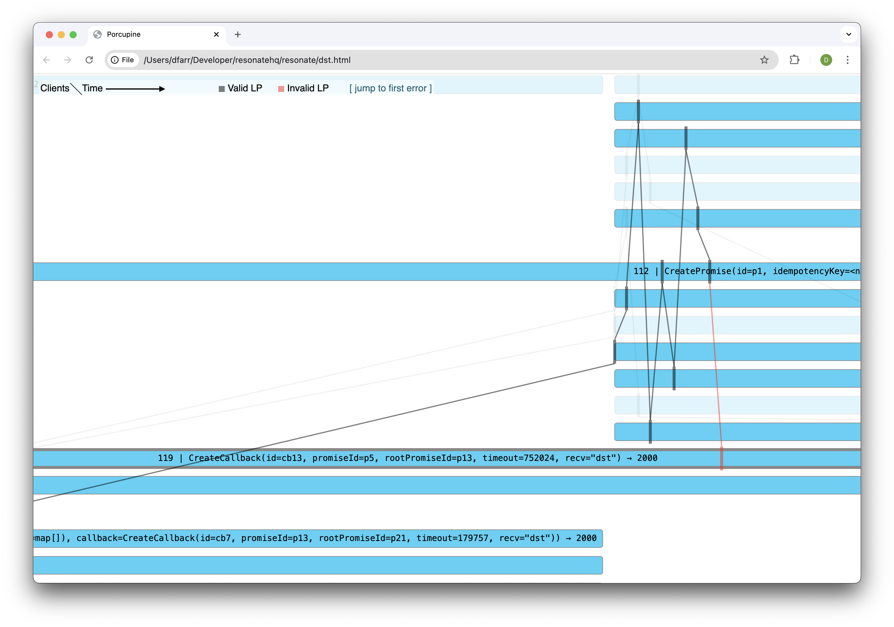

Working on a project such as Resonate that uses deterministic simulation testing (DST) extensively can be both fickle and incredibly, incredibly rewarding. You see, when DST is a regular part of your testing strategy you tend to anticipate and avoid the type of bugs that DST is so good at finding in the first place. So much so that when an automated GitHub issue [such as this one](https://github.com/resonatehq/resonate/issues/479) pops up, you tend to assume there is a bug in the test code rather than a bug in the system itself.

But this is a story about a time when DST found a real bug.

<!-- truncate -->

## Promises and Callbacks

Two fundamental concepts of Resonate are Promises and Callbacks. If you want to learn more about these concepts I recommend checking out the [Durable Promise Specification](https://github.com/resonatehq/durable-promise-specification).

For the purpose of this post it is sufficient to understand that Resonate exposes a create API for both promises and callbacks and a convenience API that atomically creates a promise and a callback. A callback is registered against a promise.

```
CreatePromise(pid)
CreateCallback(pid, cid)
CreatePromiseAndCallback(pid, cid)
```

## Seed 23496

Resonate DST (deterministically) randomly generates requests and fires them off against the server. We use a seed to configure the test so that if we see a failure on GitHub Actions we can easily reproduce the same failure locally.

One of these failures occurs with seed 23496.

You can check it out for yourself! Clone the [resonate repository](https://github.com/resonatehq/resonate) and run the DST command.

```bash
# checkout specific commit
git checkout 1f1a419

# run dst
go run ./... dst run --seed 23496 --ticks 1000
```

If all goes right (or wrong depending on your perspective) a log of all requests will be printed to the console ending with the following error message.

```
level=ERROR msg="DST is non linearizable"
Error: DST failed for seed='23496'
```

Resonate uses [Porcupine](https://github.com/anishathalye/porcupine), a fantastic go project, to verify the linearizability of the concurrent requests sent and responses received by the test. Porcupine also generates a visualization you can see by opening up `dst.html` in a browser, click “jump to first error” to see where Porcupine could no longer verify linearizability.



## The Investigation

We can use the request log and the visualization to help us determine what exactly went wrong. Looking in the vicinity of the first error, three requests stand out as interesting.

| **Id** | **Request**                                | **Resonate Status** | **Http Status** |
| ------ | ------------------------------------------ | ------------------- | --------------- |
| 78     | CreatePromise(pid=p5)                      | 2010                | 201             |
| 90     | CreatePromiseAndCallback(pid=p5, cid=cb13) | 4090                | 409             |
| 119    | CreateCallback(pid=p5, cid=cb13)           | 2000                | 200             |

CreatePromise (request 78) results in a 2010 status code. Resonate status codes can be converted to http response codes by dividing by 10 and rounding down, here a 201 indicates that the promise was created successfully.

CreatePromiseAndCallback (request 90) results in a 4090 indicating a conflict, the promise already exists.

CreateCallback (request 119) results in a 2000 indicating the callback was successfully deduplicated, but not created, by this request. The callback must already exist.

Inspecting the logs further we can verify that at no point in time prior to request 119 was a callback with id cb13 created. All indicators are pointing towards an erroneous callback creation, perhaps our atomic CreatePromiseAndCallback request is not so atomic after all.

| **Id** | **Request**                                | **Actual** | **Expected** |
| ------ | ------------------------------------------ | ---------- | ------------ |
| 78     | CreatePromise(pid=p5)                      | 201        | 201          |
| 90     | CreatePromiseAndCallback(pid=p5, cid=cb13) | 409        | 409          |
| 119    | CreateCallback(pid=p5, cid=cb13)           | 200        | 201          |

## The Bug

CreatePromiseAndCallback is a relatively recent addition to Resonate and a likely culprit, so I dug into the SQL queries. The request is intended to be atomic; either both the promise and callback are created or neither are. Let’s look at the queries, understanding that these occur in a transaction.

```sql
# Create Promise
INSERT INTO promises(id) VALUES ('p5') ON CONFLICT(id) DO NOTHING

# Create Callback
INSERT INTO callbacks(id, promise_id)
  SELECT
    'cb5', 'p5'
  WHERE EXISTS
    (SELECT 1 FROM promises WHERE id = 'p5' AND state = 1)
```

Aha! The create promise query has an on conflict clause that effectively undoes the atomicity guarantees of the transaction. So when the CreatePromiseAndCallback request occurs the promise is not created, but the callback _is_. Our DST model is rightfully unaware that callback cb13 exists and therefore returns an error when CreateCallback returns a 200, indicating deduplication.

## Reflection

How long would it have taken us to discover this bug without deterministic simulation testing? And how many productive systems would have been affected? It’s perhaps hard to say for certain, but I for one am happy we have DST.
